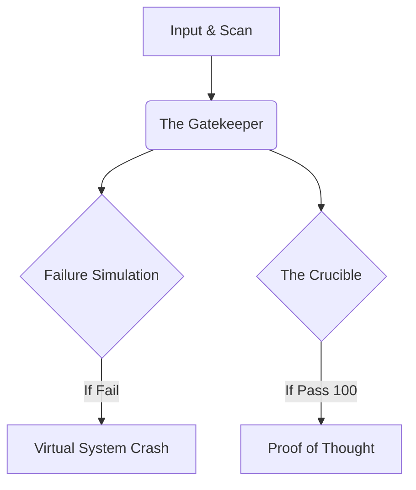

[TARK_README.md](https://github.com/user-attachments/files/29559663/TARK_README.md)
# TARK — Cognitive Verification Loop

**Stop memorizing, start reasoning.**

TARK is an AI-powered reasoning auditor. Instead of answering your questions, it interrogates *your* explanation of a concept, scores it against Bloom's Taxonomy, and either certifies your logic or simulates the consequences of getting it wrong.

## How it works

1. **Initiation** — Pick a domain (Coding, Studies, Banking Advice Logic) and explain your reasoning.
2. **Interrogation** — TARK audits the logic for hidden or dangerous assumptions.
3. **Scaling** — Novices get real-world analogies; experts get Red Team optimization challenges.
4. **Failure-First Protocol** — Flawed logic triggers a "Virtual System Crash" simulation instead of a generic error.
5. **Proof of Thought** — A perfect score (100) mints a unique cryptographic hash as a certificate.



## Tech Stack

**Backend**
- FastAPI (REST API, async request handling)
- AWS Bedrock — Meta Llama 3.1 8B Instruct (via `converse` API, with raw `invoke_model` fallback)
- Pydantic — strict schema validation on LLM outputs
- `json-repair` — recovers malformed JSON from LLM responses
- boto3

**Frontend**
- React 19 + Vite
- TailwindCSS 4
- Framer Motion (animation)
- Mermaid.js (dynamic audit-path flowcharts)

**Alternate UI**
- Streamlit client with a custom glassmorphism/space theme and animated canvas background

## Key Engineering Details

- **Server-side score enforcement**: if the LLM assigns a high confidence score but the reasoning depth doesn't match the requested Bloom's level, the backend overrides/caps the score rather than trusting the model blindly.
- **Structured output resilience**: LLMs occasionally return malformed or nested JSON. The backend strips markdown fences, extracts the outermost JSON object via regex, and repairs it with `json_repair` before validating against a strict Pydantic schema — with one automatic retry on validation failure.
- **Proof of Thought hashing**: perfect audits are stamped with a SHA-256 hash derived from the input, domain, and timestamp.

## Running Locally

### Backend
```bash
cd backend
pip install -r requirements.txt
# Set AWS credentials in a .env file:
# AWS_ACCESS_KEY_ID=...
# AWS_SECRET_ACCESS_KEY=...
# AWS_REGION=us-east-1
python main.py
```

### Frontend
```bash
cd frontend
npm install
npm run dev
```

### Streamlit alternative
```bash
cd backend
streamlit run app.py
```

## Status

Hackathon prototype — actively evolving.
